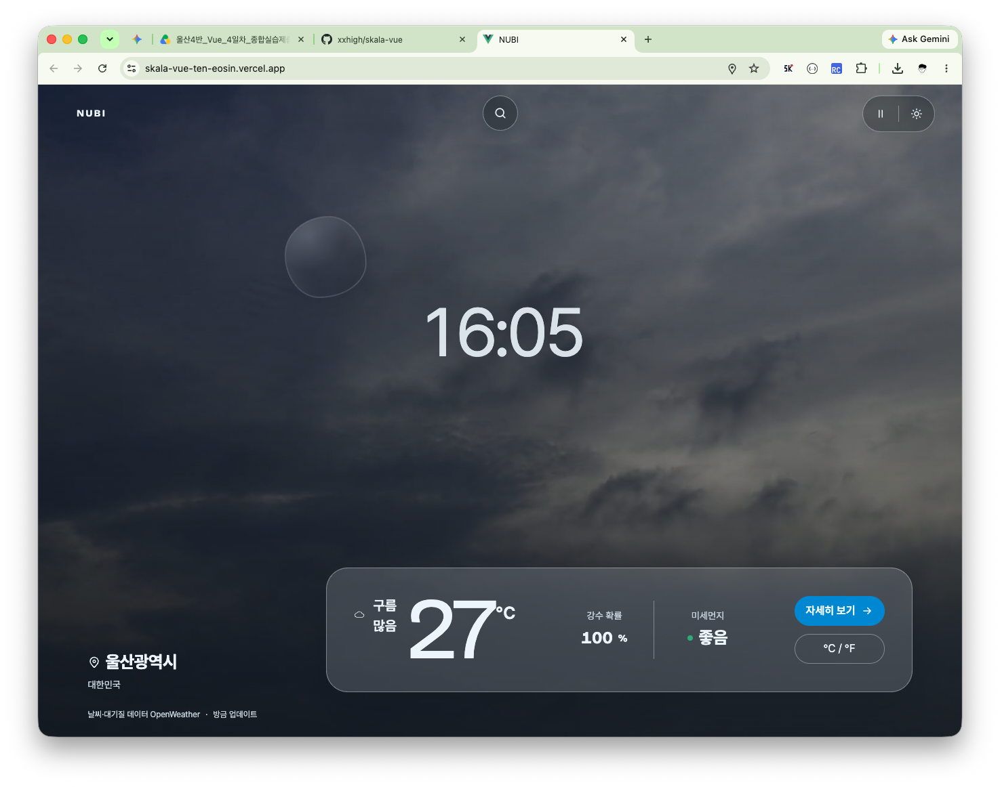
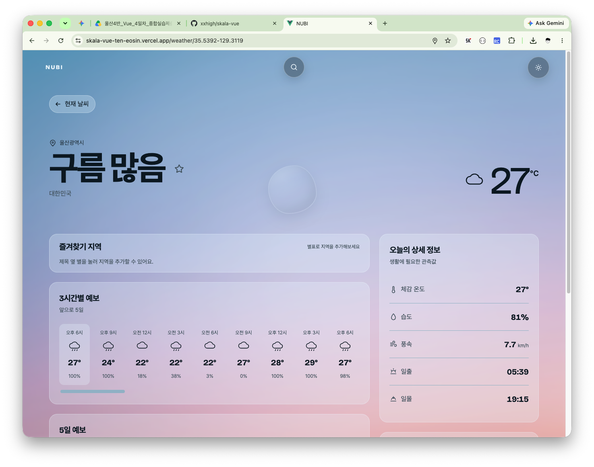
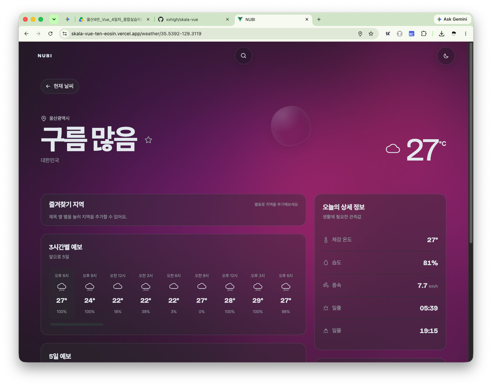
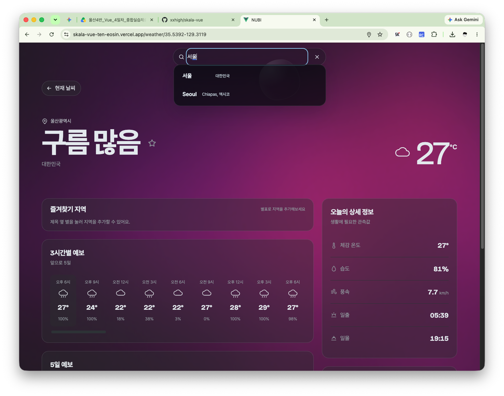
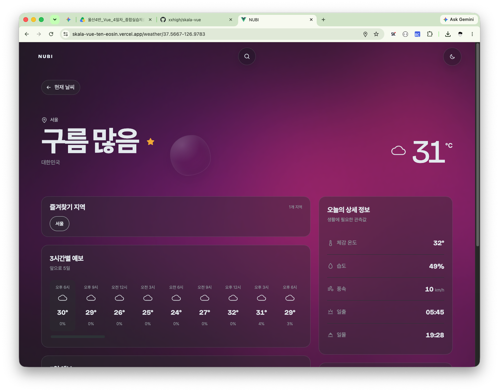

# NUBI Weather

NUBI는 현재 위치의 날씨를 빠르게 확인할 수 있도록 만든 모바일 중심 Vue 애플리케이션입니다. 랜딩 화면에서는 현재 기온, 강수 확률, 미세먼지와 지역 시각을 간결하게 보여주고, 상세 화면에서는 3시간 간격 예보와 5일 전망을 제공합니다.

> DEMO
> 
> https://skala-vue-ten-eosin.vercel.app/

## SNAPSHOT


_랜딩 페이지_


_상세화면/라이트모드_


_상세화면/다크모드_


_지역검색_


_즐겨찾기_

## 주요 기능

1. 브라우저 위치 권한으로 현재 지역을 조회하고, 권한 거부 또는 조회 실패 시 대한민국 서울을 기본 지역으로 사용
2. 현재 기온, 체감 온도, 습도, 풍속, 강수 확률과 PM2.5·PM10 대기질 정보 표시
3. OpenWeather의 3시간 간격 예보를 날짜별로 집계한 5일 예보 제공
4. 중앙 버튼에서 확장되는 도시 자동완성 검색과 최근 검색 도시 최대 5개 저장
5. 상세 화면에서 지역 즐겨찾기 추가·삭제 및 즐겨찾기 도시 간 빠른 전환
6. 섭씨·화씨 단위 전환과 라이트·다크 테마 지원
7. 표시 중인 도시의 현지 시각을 `HH:MM` 형식으로 실제 분 전환에 맞춰 갱신
8. 현재 날씨와 주야간 상태에 맞는 랜딩 배경 영상 및 헤더 재생·일시정지 제어
9. 상세 화면의 테마별 정적 배경과 스크롤 시 나타나는 고정 헤더 배경·구분선
10. 랜딩과 상세 배경 위에서 마우스를 따라 이동하는 가벼운 물방울 Blur 렌즈 효과
11. 동작 줄이기 또는 데이터 절약 환경에서 영상·포인터 효과를 비활성화하고 정적 이미지 사용
12. 로딩 스켈레톤과 API 오류 유형에 따른 사용자 안내

## 기술 스택

- Vue 3(Composition API)
- Vite 8
- Vue Router 5
- Pinia 3
- Axios
- PrimeVue 4.5.5(Unstyled)
- OpenWeather

PrimeVue는 `AutoComplete`, `Skeleton`, `Message`의 동작과 접근성에 사용합니다. 전역 `unstyled` 모드를 적용하여 PrimeVue 기본 테마 대신 `tokens.css`와 `src/assets/weather.css`가 모든 시각 표현을 담당합니다. 기본 본문 글꼴은 Pretendard Variable이며, 영문 제목과 큰 숫자에는 Bricolage Grotesque를 사용합니다.

## 화면 구성

- 공통 헤더: 왼쪽 NUBI 로고, 중앙 확장형 검색, 오른쪽 화면 설정
- 랜딩 헤더: `동영상 제어 | 테마 변경` 순서로 표시
- 상세 헤더: 테마 변경 버튼만 표시하며 스크롤 시 배경과 하단 구분선 활성화
- 랜딩 화면: 도시 현지 시각, 위치, 현재 날씨 요약 및 상세 이동
- 상세 화면: 즐겨찾기, 3시간별 예보, 5일 예보, 생활 관측값, 대기질

물방울 Blur 렌즈는 랜딩과 상세 화면 모두에서 배경 위를 따라 이동합니다. 콘텐츠 클릭을 방해하지 않으며 정밀 마우스 환경에서만 활성화됩니다. 터치 기기와 `prefers-reduced-motion` 환경에서는 표시하지 않습니다.

## 시작하기

Node.js `^20.19.0` 또는 `>=22.12.0`이 필요합니다.

```bash
npm install
cp .env.example .env.local
```

`.env.local`에 OpenWeather API 키를 입력합니다.

```dotenv
VITE_OPENWEATHER_API_KEY=your_api_key_here
```

개발 서버를 실행합니다.

```bash
npm run dev
```

새 API 키는 발급 직후 활성화까지 시간이 걸릴 수 있습니다. `401` 오류가 계속되면 OpenWeather 계정에서 키 상태를 확인하세요.

## 날씨 미디어

배경 리소스는 `public/resources/`에 둡니다. 파일명의 `_0`은 주간, `_1`은 야간 변형입니다.

```text
bg_white.jpg
bg_dark.jpg
sunny_0.mp4       sunny_1.mp4
cloudy_0.mp4      cloudy_1.mp4
drizzle_0.mp4     drizzle_1.mp4
fog_0.mp4         fog_1.mp4
rain_0.mp4        rain_1.mp4
snowfall_0.mp4    snowfall_1.mp4
storm_0.mp4       storm_1.mp4
```

새로운 날씨 유형에 대응하는 영상이 없으면 `sunny_0.mp4`를 사용합니다. 배경 이미지와 MP4 영상은 저장소의 `public/resources/`에서 함께 관리합니다. 영상 재생이 실패하거나 사용자가 동작 줄이기·데이터 절약을 설정한 경우 테마별 `bg_white.jpg` 또는 `bg_dark.jpg`가 표시됩니다.

## 프로젝트 구조

```text
src/
├── components/weather-app/  # 헤더, 포인터 효과, 즐겨찾기, 요약 및 예보
├── stores/                  # 날씨 데이터와 사용자 설정 상태
├── utils/weather.js         # 날씨 코드 매핑과 표시 형식
├── views/                   # 랜딩 및 상세 화면
├── assets/weather.css       # 앱 레이아웃과 컴포넌트 스타일
├── router/index.js          # 홈 및 상세 라우트
├── App.vue
└── main.js
public/resources/            # 배경 이미지와 날씨 영상
tokens.css                    # 색상, 글꼴, 간격 및 모션 토큰
```

라우트는 `/`와 `/weather/:cityId`를 제공합니다. 정의되지 않은 경로는 홈으로 이동합니다.

## 데이터 처리

현재 날씨와 5일·3시간 예보는 필수 데이터입니다. 대기질 요청은 `Promise.allSettled()`로 별도 처리하므로 대기질 API만 실패해도 날씨 화면은 계속 표시됩니다. 현재 날씨 API에는 강수 확률이 없어 가장 가까운 3시간 예보의 강수 확률을 랜딩 화면에 사용합니다. 도시 현지 시각은 OpenWeather가 반환한 UTC 오프셋으로 계산하며 실제 분 전환 시점에 맞춰 갱신합니다.

테마, 최근 검색 도시, 즐겨찾기 지역은 `localStorage`에 저장됩니다. 브라우저에서 받은 현재 위치는 날씨 조회에만 사용하며 별도로 저장하지 않습니다. 영상 일시정지 상태와 섭씨·화씨 선택은 새로고침 시 초기화됩니다.

## 개발 명령

```bash
npm run dev       # 개발 서버 실행
npm run build     # dist/ 프로덕션 번들 생성
npm run preview   # 빌드 결과 로컬 확인
npm run lint      # Oxlint와 ESLint 검사 및 안전한 자동 수정
npm run format    # src/ 아래 파일을 Prettier로 정리
```

자동화된 테스트 프레임워크는 아직 구성되어 있지 않습니다. 변경 후 최소한 `npm run lint`와 `npm run build`를 실행하세요. UI 변경 시 320px부터 데스크톱까지 확인하고 위치 거부, 도시 검색, 현지 시각, 영상 제어, 테마·단위 전환, 즐겨찾기 및 상세 이동을 직접 검증하세요. 데스크톱에서는 포인터 Blur 추적과 상세 화면 스크롤 헤더도 확인합니다.

## 배포 및 보안

`VITE_` 접두사의 환경변수는 브라우저 번들에 포함됩니다. 현재 구성은 학습 및 프로토타입 용도이며, 공개 서비스에서는 OpenWeather 요청을 서버 프록시나 서버리스 함수로 옮겨 API 키를 클라이언트에 노출하지 않아야 합니다. `.env.local`, `dist/`, API 키는 커밋하지 마세요.
