# Skala-vue
본 프로젝트는 Vue3 기반 날씨 어플리케이션입니다.

## Components & Router & Store
### 실습 3일차

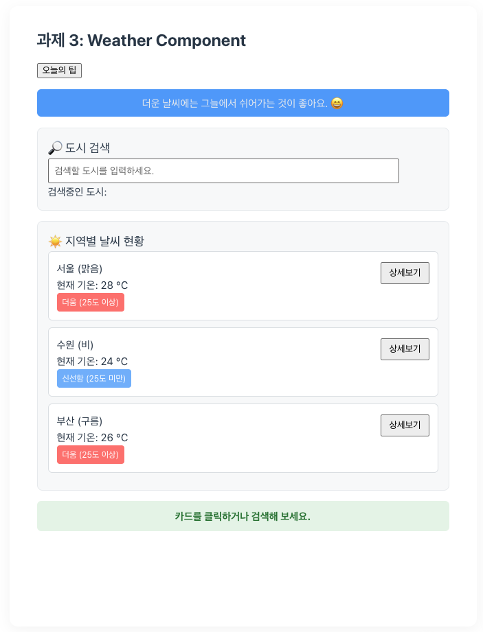

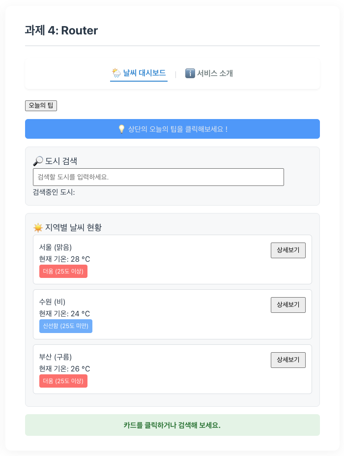


_실습 3일차까지 완성된 모습_

### 파일 경로

```js
// Components
src/Components/Weather/WeatherParent.vue
src/Components/Weather/BaseDashboardCard.vue
src/Components/Weather/SearchBar.vue
src/Components/Weather/TipQuotes.vue
src/Components/Weather/WeatherCard.vue

// Router
src/router/index.js

src/views/WeatherHomeView.vue
src/views/WeatherDetailView.vue
src/views/WeatherAboutView.vue
src/views/NotFoundView.vue
src/views/ClockView.vue

// Store
src/stores/configStore.js
src/stores/weatherStore.js
```
### Vue Components

**요구사항**
- [x] WeatherParent.vue
- [x] BaseDashboardCard.vue
- [x] SearchBar.vue
- [x] WeatherCard.vue
- [x] 각 컴포넌트로 분리하면서 컴포넌트에 해당되는 디자인은 <style scoped>로 분리
- [x] 추가 컴포넌트

**코드**

```js
<script setup>
defineProps({
  quote: {
    type: String,
    default: '💡 상단의 오늘의 팁을 클릭해보세요 !',
  },
})

const emit = defineEmits(['refresh-tip'])

const handleRefreshTip = () => {
  const r = Math.random()
  emit('refresh-tip', r >= 0.6 ? 0 : r >= 0.3 ? 1 : 2)
}
</script>

<template>
  <div class="container">
    <button @click="handleRefreshTip()">오늘의 팁</button>
    <div class="tip-box">
      <p>{{ quote }}</p>
    </div>
  </div>
</template>

<style scoped>
.tip-box {
  margin: 1rem 0;
  display: flex;
  flex-direction: column;
  gap: 10px;
  background: #4ba5ff;
  padding: 0.5rem;
  border-radius: 6px;
  text-align: center;
  color: #e9ecef;
  font-weight: bold;
}
</style>
```
- 기존에 오늘의 팁 관련 요소를 컴포넌트화
- 문구는 부모 컴포넌트에서 오도록 Props 처리
- 버튼을 눌러 r 값을 emit으로 부모에게 이벤트

### Router

**요구사항**
- [x] Vue Router 설정
- [x] App.vue
- [x] WeatherHomeView.vue
- [x] WeatherDetailView.vue
- [x] WeatherAboutView.vue
- [x] 추가 View

**스냅샷**

|사진|뷰|
|---|---|
||WeatherHomeView|
|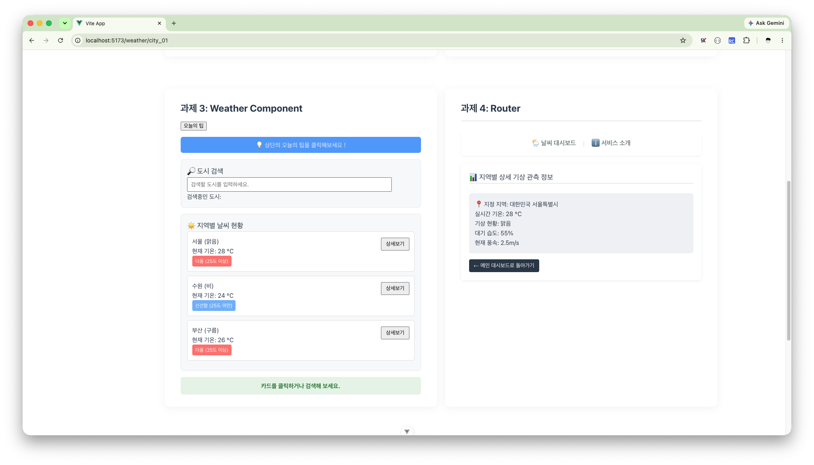|WeatherDetailView|
|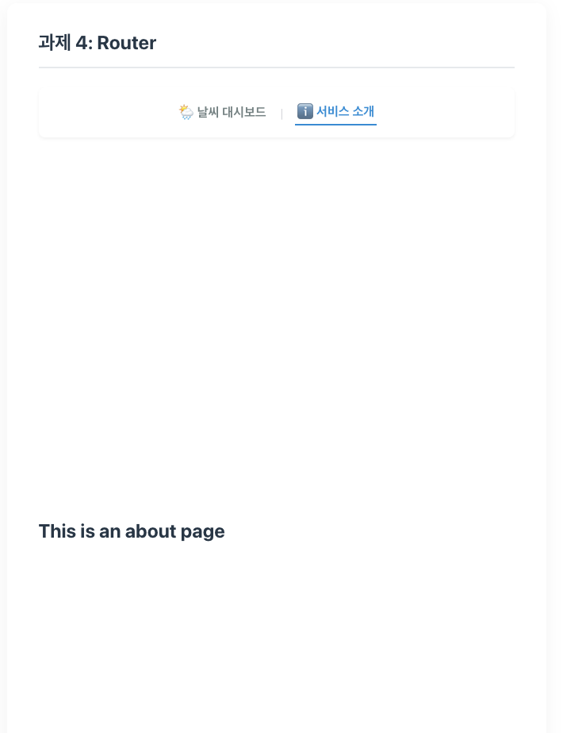|WeatherAboutView|
|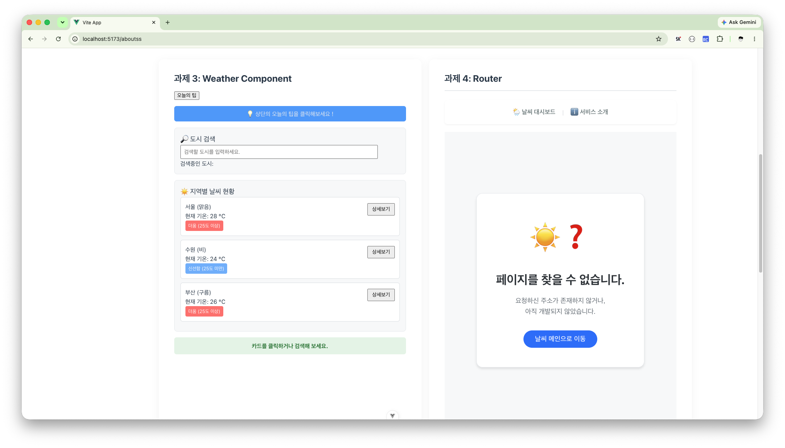|NotFoundView|
|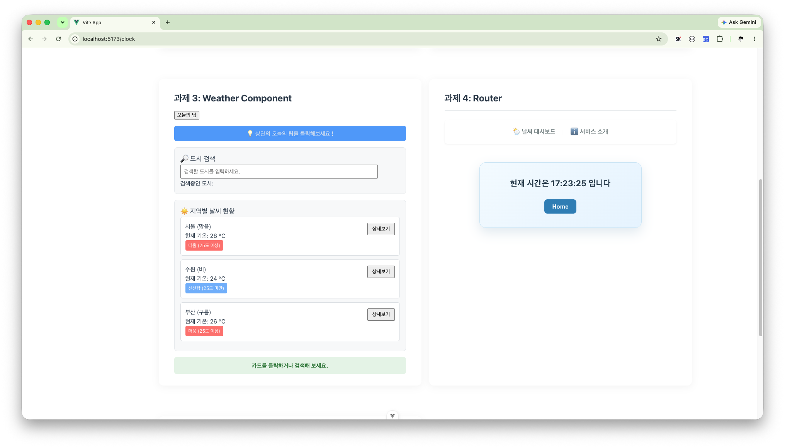|ClockView|

**코드**
```js
<script setup>
import { ref, onUnmounted } from 'vue'
import { useRouter } from 'vue-router'

const currentTime = ref(new Date())

const router = useRouter()

const timer = setInterval(() => {
  currentTime.value = new Date()
}, 1000)

onUnmounted(() => {
  clearInterval(timer)
  console.log('Timer가 종료되었습니다.')
})

const formatZero = (num) => String(num).padStart(2, '0')
</script>

<template>
  <div class="clock-box">
    <p class="time-text">
      현재 시간은 {{ formatZero(currentTime.getHours()) }}:{{
        formatZero(currentTime.getMinutes())
      }}:{{ formatZero(currentTime.getSeconds()) }} 입니다
    </p>
    <button class="btn-home" @click="router.push('/')">Home</button>
  </div>
</template>

<style scoped>
.clock-box {
  max-width: 420px;
  margin: 48px auto;
  padding: 36px 28px;
  text-align: center;
  background: linear-gradient(135deg, #f4fbff, #e8f5ff);
  border: 1px solid #cfe8f7;
  border-radius: 16px;
  box-shadow: 0 12px 30px rgba(44, 119, 159, 0.14);
}

.time-text {
  margin: 0 0 24px;
  color: #1f3b4d;
  font-size: 1.35rem;
  font-weight: 700;
  letter-spacing: 0.02em;
}

.btn-home {
  padding: 10px 20px;
  color: #ffffff;
  background-color: #278ac0;
  border: 0;
  border-radius: 8px;
  font-size: 0.95rem;
  font-weight: 700;
  cursor: pointer;
  transition:
    background-color 0.2s,
    transform 0.2s;
}
</style>
```
- 라우터를 통해 버튼을 누르면 `'/'`으로 이동.
- setInterval를 통해 1초마다 시간 갱신.
- onUnmounted를 통해 컴포넌트가 언마운트시 인터벌 제거

### Store

**요구사항**
- [x] UnitToggler.vue
- [x] Navigation Bar 옆에 UnitToggler 배치
- [x] 메인과 상세 날씨에 단위 설정 변경 적용
- [x] 추가 Store

**스냅샷**


_섭씨 온도 표시_

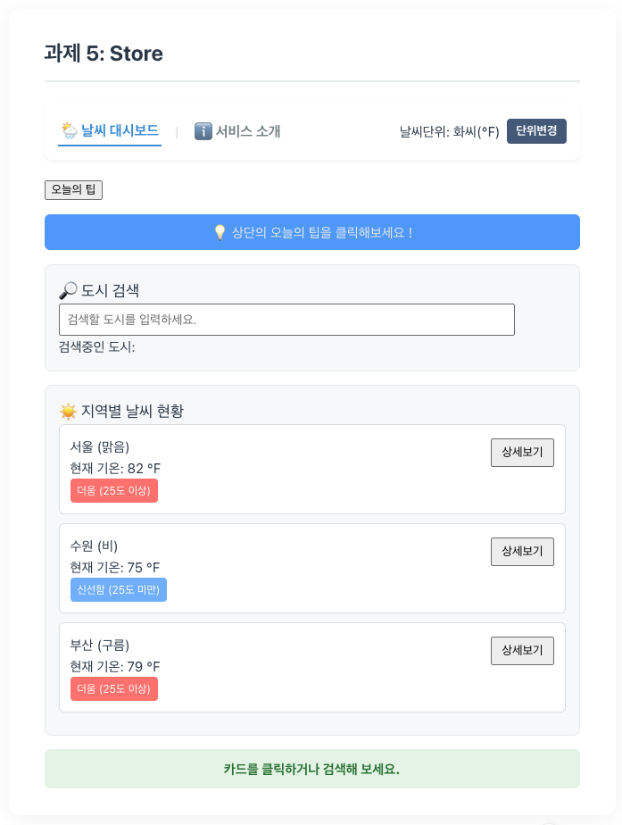

_화씨 온도 표시_

**코드**
```js
import { computed, ref } from 'vue'
import { defineStore } from 'pinia'

export const useWeatherStore = defineStore('weather', () => {
  const cities = ref([
    { id: 'city_01', name: '서울', temp: 28, status: '맑음' },
    { id: 'city_02', name: '수원', temp: 24, status: '비' },
    { id: 'city_03', name: '부산', temp: 26, status: '구름' },
  ])
  const selectedCityId = ref(null)

  const selectedCity = computed(() => cities.value.find((city) => city.id === selectedCityId.value))

  function selectCity(id) {
    selectedCityId.value = id
  }

  return {
    cities,
    selectedCityId,
    selectedCity,
    selectCity,
  }
})
```
- 날씨 관련 데이터를 Store로 관리
- selectedCity(action)을 통해 Id 값을 변경
- selectedCity(getter)로 접근해서 값을 가져옴
- 실사용 예제 코드는 `WeatherHomeView.vue`를 참고해주세요.

---

---

## Weather Mockup & Weather Composition
### 실습 2일차

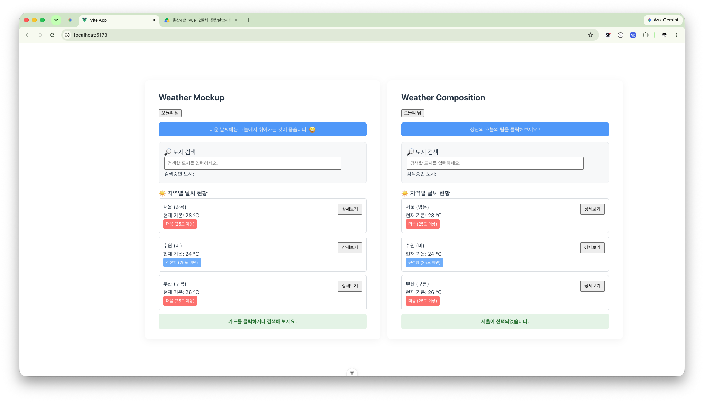

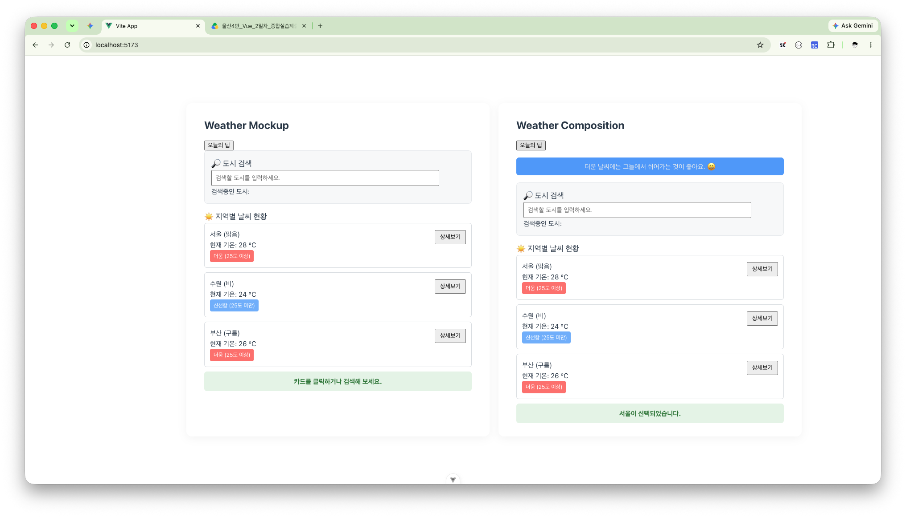

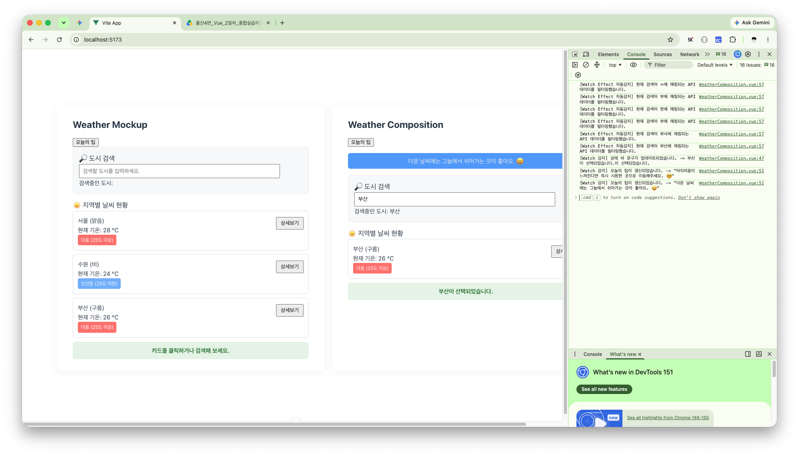

_실습 2일차까지 완성된 모습_

### 파일 경로

```js
// Weather Mockup
src/components/Weather/WeatherMockup.vue
```

```js
// Weather Composition
src/components/Weather/WeatherComposition.vue
```

### Weather Mockup

**요구사항**
- [x] 배열 렌더링 (v-for)
- [x] 조건부 렌더링 (v-if)
- [x] 양방향 바인딩 및 한글 처리
- [x] 이벤트 및 수식어
- [x] 본인만의 데이터 추가
  - `isTipVisible` 상태 변수 추가

#### 추가 사항 설명

**스냅샷**
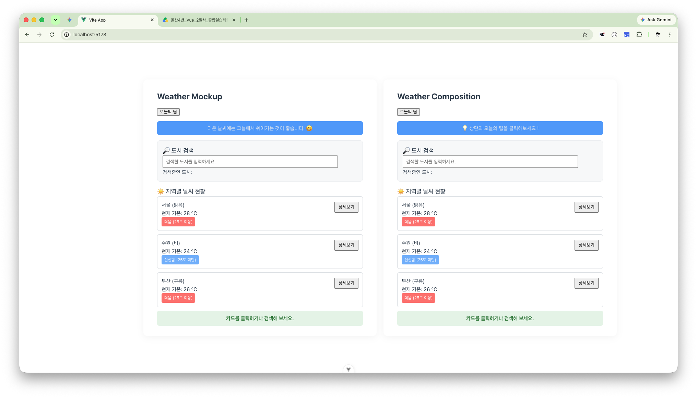
- 왼쪽 목업의 오늘의 팁 영역이 노출됩니다.


- 오늘의 팁 버튼을 클릭시 토글이되면서 영역이 사라집니다.

```js
const isTipVisible = ref(true)
```
```html
<button @click="isTipVisible = !isTipVisible">오늘의 팁</button>
<div v-show="isTipVisible" class="tip-box">
  <p>더운 날씨에는 그늘에서 쉬어가는 것이 좋습니다. 😄</p>
</div>
```
- button 클릭시 `isTipVisible`의 상태가 토글됩니다.
- v-show를 이용해서 `isTipVisible`를 바인딩했습니다.

### Weather Composition

**요구사항**
- [x] 반응형 상태 관리
- [x] 검색 도시(Computed)
- [x] 반응형 변수 변화 감시
- [x] 검색 결과 표시
- [x] 본인만의 반응형 상태 변수, Computed, Watcher 추가
  - `오늘의 팁 추가`

#### 추가 사항 설명

**스냅샷**


**코드**
```js
const tips = ref([
  '더운 날씨에는 그늘에서 쉬어가는 것이 좋아요. 😄',
  '충분한 수분을 섭취해주세요. 🚰',
  '어지러움이 느껴진다면 즉시 시원한 곳으로 이동해주세요. 😵‍💫',
])

const tip = computed(() => {
  return selectedTipIndex.value === null
    ? '💡 상단의 오늘의 팁을 클릭해보세요 !'
    : tips.value[selectedTipIndex.value]
})
const selectedTipIndex = ref(null)

const refreshTip = () => {
  const r = Math.random()
  selectedTipIndex.value = r >= 0.6 ? 0 : r >= 0.3 ? 1 : 2
}

watch(tip, (newValue) => {
  console.log(`[Watch 감지] 오늘의 팁이 갱신되었습니다. -> "${newValue}"`)
})
```
- `tips`배열에 날씨 상황에 맞는 안내 문구 3개를 저장했습니다.
- `tip`은 의존하는 반응형 데이터 `selectedTipIndex`가 변경되면 새로 계산됩니다.
- `selectedTipIndex`라는 반응형 변수를 선언하고 현재 선택된 팁의 인덱스를 반응형으로 관리합니다.
- `refreshTip()` 함수를 호출할 때마다 난수를 생성하고 `selectedTipIndex`를 갱신합니다.
- `watch`를 통해 오늘의 팁이 변경될 때마다 콘솔에 출력됩니다.